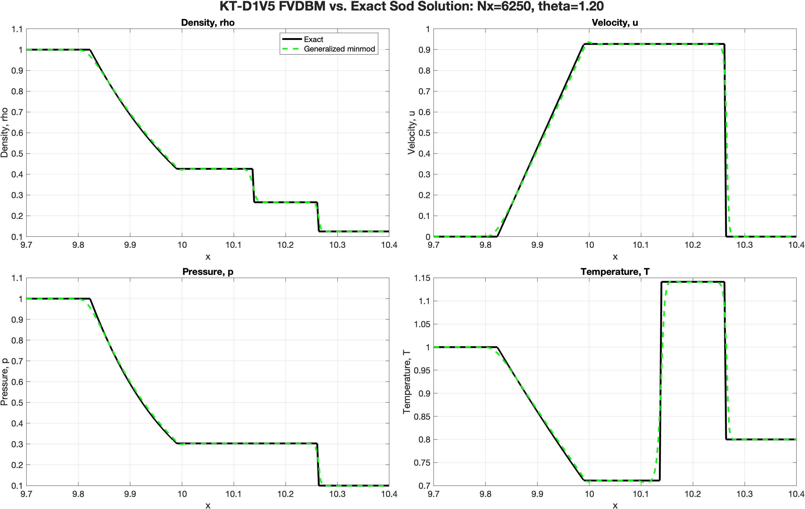
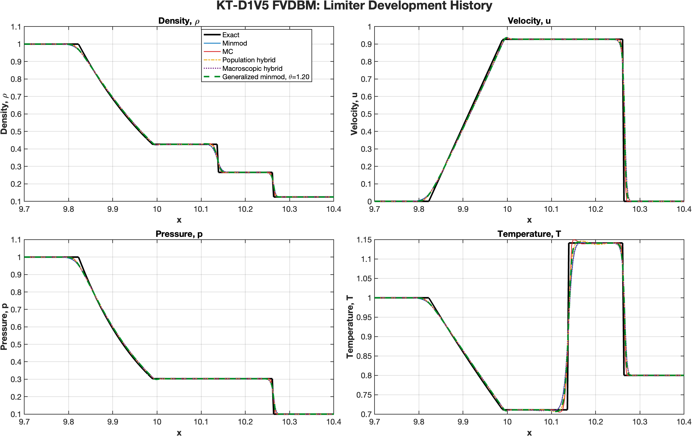
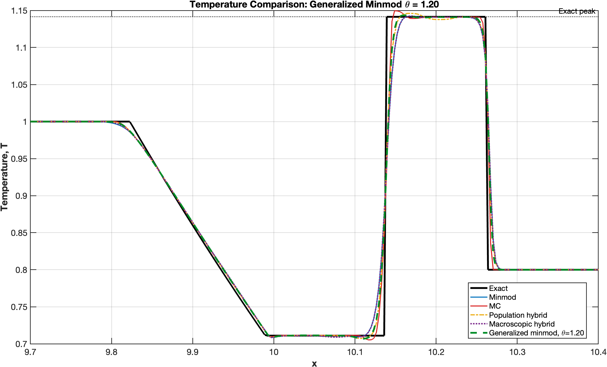
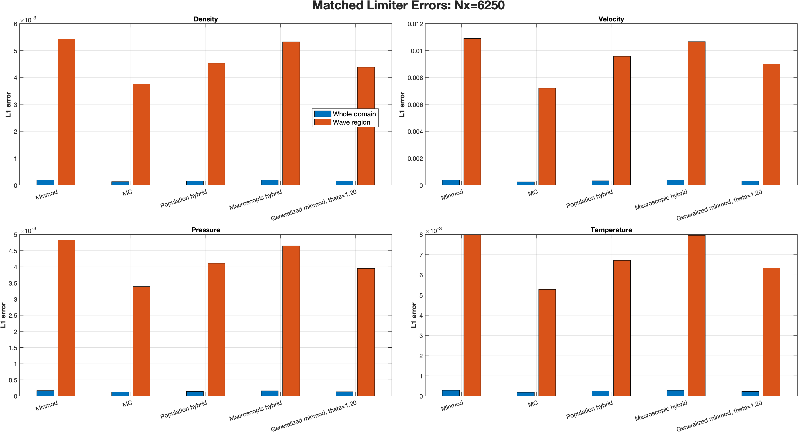
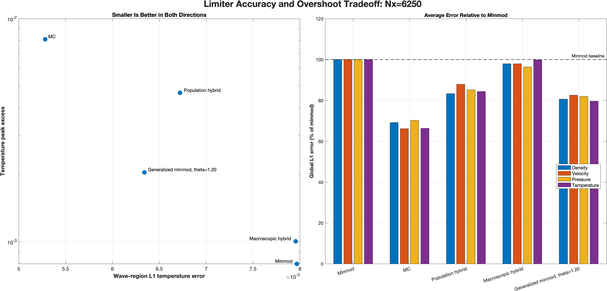
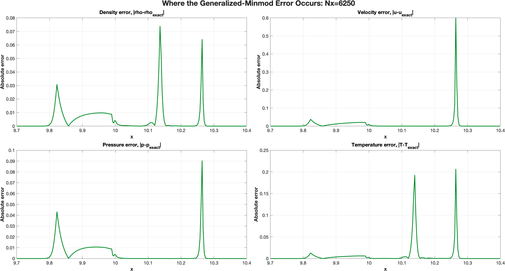
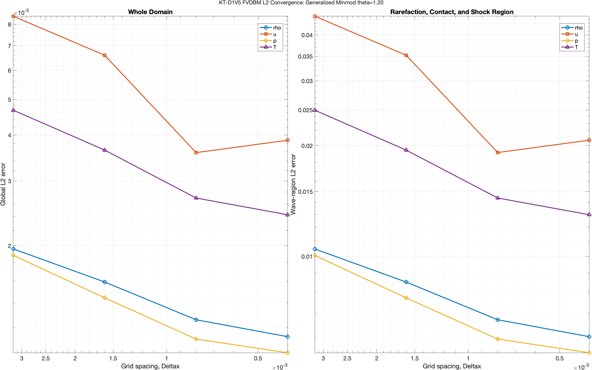

# Finite-Volume Discrete Boltzmann Research

This repository documents the development of a finite-volume discrete
Boltzmann method (FVDBM) for compressible-flow problems. The immediate goal is
to build and validate the numerical foundation in one dimension before moving
to two-dimensional shock tubes and supersonic flow over a wedge.

## Research path

```text
1D Sod shock tube
        ↓
2D planar and genuinely 2D shock-tube validation
        ↓
2D supersonic wedge flow
        ↓
3D validation and wedge flow
        ↓
Possible airfoil applications
```

The project is currently completing the one-dimensional stage. The D1V5
solver has been implemented and compared with the exact Sod solution. A
two-dimensional solver has not yet been selected or implemented as part of the
reported research.

| Part of the project | Current status |
|---|---|
| KT-D1V5 Sod solver | Working MATLAB reference implementation |
| Exact Euler comparison | Implemented for density, velocity, pressure, and temperature |
| Limiter comparison | Minmod, MC, two hybrid attempts, and generalized minmod compared |
| Error measurement | Global and wave-region L1/L2 errors plus temperature peak excess |
| Grid study | Completed on 6,250–50,000 cells; improvement is not cleanly second order |
| Wedge solver | Not yet implemented |

## Why begin with the Sod shock tube?

The Sod problem begins with two stationary gas states separated by a
diaphragm:

| State | Density, `rho` | Velocity, `u` | Pressure, `p` |
|---|---:|---:|---:|
| Left | 1.000 | 0.000 | 1.000 |
| Right | 0.125 | 0.000 | 0.100 |

Removing the diaphragm produces three different wave features:

- a smooth rarefaction wave moving left;
- a contact discontinuity moving right; and
- a shock moving farther to the right.

One short calculation therefore checks smooth transport, discontinuity
capture, shock speed, thermodynamic recovery, stability, and boundary
treatment. An exact inviscid Euler solution is also available, so numerical
errors can be measured instead of judged only by how a graph looks.

## Current numerical model

The code advances five discrete particle populations with

```text
df_i/dt + c_i df_i/dx = (f_i^eq - f_i)/tau.
```

| Component | Choice in the reference solver | Purpose |
|---|---|---|
| Kinetic model | Kataoka–Tsutahara D1V5 | Represents compressible mass, momentum, and energy moments |
| Discrete velocities | `[-3, -1, 0, 1, 3]` | Moves five populations in one physical dimension |
| Internal-energy parameter | `eta0 = 1.75` on the rest population | Allows the desired specific-heat ratio |
| Collision | Single-relaxation-time BGK | Relaxes populations toward local equilibrium |
| Spatial discretization | Cell-centered finite volume | Computes population transport through cell faces |
| Face reconstruction | MUSCL | Reconstructs left and right states at each face |
| Limiter | Generalized minmod, `theta = 1.20` | Balances minmod stability against MC sharpness |
| Upwinding | Based on the sign of each `c_i` | Selects the population arriving at a face |
| Time integration | SSP-RK3 | Reduces temporal error and preserves strong-stability properties |
| Boundaries | Transmissive copying | Lets waves leave with minimal reflection when they reach a boundary |

### D1V5 does not mean lattice streaming

`D1V5` describes the **velocity model**: one physical dimension and five
discrete molecular velocities. The physical domain is still divided into
finite-volume cells, and fluxes are computed at their faces. The populations
are not required to jump exactly from one lattice node to another in one time
step.

## Run the MATLAB code

The main implementation is
[`d1v5_sodshock_gminmod_rk3.m`](matlab/d1v5/d1v5_sodshock_gminmod_rk3.m).

From MATLAB:

```matlab
cd matlab/d1v5
d1v5_sodshock_gminmod_rk3
```

The published default uses `Nx = 50000`, `Lx = 20`, `tau = 5e-5`,
`CFL = 0.10`, `tEnd = 0.15`, and `theta = 1.20`. For a faster learning run,
override the grid without editing the file:

```matlab
setenv('DBM_NX','6250')
d1v5_sodshock_gminmod_rk3
setenv('DBM_NX','')
```

Additional workflows and output definitions are explained in the
[MATLAB guide](matlab/README.md).

## Reproduced one-dimensional result

The following result was regenerated from the public MATLAB code using
`Nx = 6250`. The run completed 12,000 accepted time steps in 39.96 seconds on
the development machine, with zero retries and zero fallback-limiters. Runtime
is machine-dependent; the error values are the useful comparison.

| Global L1 error | Value |
|---|---:|
| Density | `1.534213e-4` |
| Velocity | `3.150135e-4` |
| Pressure | `1.384924e-4` |
| Temperature | `2.222085e-4` |

The temperature peak exceeded the exact peak by `2.048193e-3`, or `0.179443%`.



Full machine-readable values are in
[`d1v5_gminmod_reference_Nx6250_metrics.csv`](results/d1v5_gminmod_reference_Nx6250_metrics.csv).

## What the limiter study showed

All five cases below used the same `Nx = 6250`, physical model, initial
condition, domain, relaxation time, CFL number, and SSP-RK3 integrator. Only
the reconstruction limiter changed.

| Limiter | Global L1(T) | Wave L1(T) | Temperature peak excess |
|---|---:|---:|---:|
| Minmod | `2.791803e-4` | `7.967473e-3` | `7.964756e-4` |
| MC | `1.851267e-4` | `5.283297e-3` | `8.087784e-3` |
| Population hybrid | `2.355076e-4` | `6.721108e-3` | `4.650723e-3` |
| Macroscopic hybrid | `2.787301e-4` | `7.954627e-3` | `1.005029e-3` |
| Generalized minmod, `theta=1.20` | `2.222085e-4` | `6.341566e-3` | `2.048193e-3` |

The comparison does **not** identify one limiter as best in every metric:

- MC had the smallest average errors, but its peak excess was almost four
  times the generalized-minmod value.
- Minmod produced the smallest peak excess, but it had the largest global and
  wave-region errors because it smeared the solution more strongly.
- Generalized minmod reduced MC's peak excess by about 75% while reducing all
  four global L1 errors by about 17–20% relative to minmod.

This is why `theta = 1.20` is the present compromise, not a claim that it is a
universally optimal limiter.





The next figure separates whole-domain and wave-region error. The wave-region
bars are larger because they do not average the error over the long,
undisturbed parts of the tube.



The tradeoff plot makes the limiter decision more direct: moving left reduces
wave-region temperature error, while moving downward reduces overshoot. MC
moves farthest left but also moves sharply upward; generalized minmod remains
between the minmod and MC extremes.



Finally, the spatial error profiles show where the generalized-minmod result
differs from the exact solution. Most error is concentrated around wave edges
rather than in the constant regions.



## Grid-convergence finding

A four-grid study used `Nx = 6250, 12500, 25000, 50000` while holding
`Lx = 20`, `tau = 5e-5`, `CFL = 0.10`, `tEnd = 0.15`, and `theta = 1.20`
fixed. Density, pressure, and temperature L2 errors decreased on every grid.
Velocity improved through 25,000 cells and then increased slightly at 50,000.

The percentage reductions below are **endpoint comparisons from the coarsest
grid (`Nx=6250`) to the finest grid (`Nx=50000`)**. They are not reductions at
each individual refinement step. Each value is calculated as
`100*(L2_coarse-L2_fine)/L2_coarse`.

| Field | L2 at `Nx=6250` | L2 at `Nx=50000` | Coarse-to-fine reduction |
|---|---:|---:|---:|
| Density | `1.960774e-3` | `1.131536e-3` | `42.3%` |
| Velocity | `8.419527e-3` | `3.871277e-3` | `54.0%` |
| Pressure | `1.883587e-3` | `1.023180e-3` | `45.7%` |
| Temperature | `4.674423e-3` | `2.428375e-3` | `48.0%` |

The end-to-end effective orders were approximately:

| Field | Effective order |
|---|---:|
| Density | `0.264` |
| Velocity | `0.374` |
| Pressure | `0.293` |
| Temperature | `0.315` |

These values do **not** support a formal second-order convergence claim. Shock
and contact discontinuities reduce the observed order, and the fixed
relaxation time means the study mixes spatial error with finite-`tau` model
effects.



See the [full convergence report](reports/d1v5_gminmod_L2_convergence_report.md)
and [CSV table](results/d1v5_gminmod_L2_convergence_results.csv).

## Repository map

| Path | Contents |
|---|---|
| [`matlab/d1v5/`](matlab/d1v5/) | Current 1D solver, limiter comparison, and convergence driver |
| [`matlab/archive/`](matlab/archive/) | Earlier limiter implementations retained to document decisions |
| [`results/`](results/) | Versioned figures and machine-readable numerical results |
| [`reports/`](reports/) | Detailed convergence and limiter-development explanations |
| [`SOURCES.md`](SOURCES.md) | Papers and books used for model and numerical-method decisions |
| [`METHODOLOGY.md`](METHODOLOGY.md) | Chronological explanation of what was attempted and why |

## Important limitations

- The current validated result is one-dimensional.
- The exact curve is an inviscid Euler solution, while the DBM calculation has
  finite relaxation time. The reported difference is therefore not purely
  spatial discretization error.
- The long domain keeps the waves away from the boundaries. Changing `Lx`
  without changing `Nx` also changes `dx`, so domain and resolution studies
  must be separated carefully.
- A two-dimensional discrete-velocity model and solver have not yet been
  selected and validated.
- No wedge or airfoil result is claimed in this repository yet.

## Next controlled work

1. Repeat the D1V5 study while scaling `tau` and the time step with `dx`.
2. Measure individual rarefaction, contact, and shock position/width errors.
3. Select a published two-dimensional discrete-velocity model and verify all
   required equilibrium moments before implementing it.
4. Perform a genuine two-dimensional shock-tube test.
5. Add wall and inflow/outflow boundary conditions for a 2D wedge.
6. Compare the computed oblique-shock angle with oblique-shock theory before
   studying thermodynamic nonequilibrium quantities.

## References

The model, limiter, finite-volume, and benchmark sources are collected in
[`SOURCES.md`](SOURCES.md). Equations should be traced to the cited paper
rather than to comments or summaries alone.
